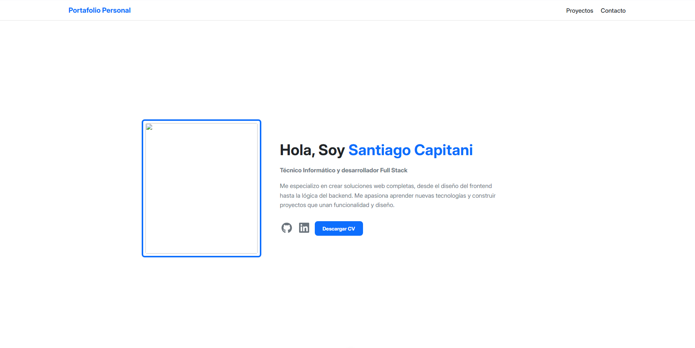

# Personal Portfolio - Santiago Capitani

 This is my personal portfolio repository, a single-page application (SPA) developed to showcase my projects, my training, and the technologies I master.

**
Link to the live site:** [tu-portfolio.com](https://tu-portfolio.com) Coming Soon

Portfolio Sections

- **Professional Profile:** A welcome section with my description and links to professional networks.
- **Education Timeline:** An interactive component showing my academic career.
- **Technology Grid:** A visual display of the technologies and tools I work with.
- **Project Gallery:** Cards with my most notable projects, including descriptions, technologies, and links to repositories.
- **Contact Form:** A form for visitors to get in touch with me.

## Technologies Used

This project was built using the following technologies:

- **Frontend:** Vue.js 3 (Composition API)
- **Bundler:** Vite
- **Styles:** CSS3 with native variables.
- **Extra** EmailJS to give functionality to the contact form

## Installation and Start-up

If you want to run this project locally, follow these steps:

1. **Clone the repository:**
   ```sh
   git clone [https://github.com/Santiagocapi/Portafolio_Vue.git](https://github.com/Santiagocapi/Portafolio_Vue.git)
   ```
2. **Navigate to the project directory:**
   ```sh
   cd Portafolio_Vue
   ```
3. **Install the dependencies:**
   ```sh
   npm install
   ```
4. **Run the development server:**
   ```sh
   npm run dev
   ```
   The application will be available at `http://localhost:5173` (or whatever port Vite specifies).

## Available Scripts

In this project, you can run the following scripts defined in `package.json`:

- `npm run dev`: Starts the development server with hot-reload.
- `npm run build`: Compiles and minimizes the application for production.
- `npm run preview`: Serves the production build locally for preview.
- `npm run lint`: Runs ESLint and Oxc to find and fix problems in the code.
- `npm run format`: Formats all project code with Prettier.

## Contact

You can contact me through:

- **LinkedIn:** [Santiago Capitani Clavero](https://www.linkedin.com/in/santiago-capitani-clavero-038252327)
- **GitHub:** [@Santiagocapi](https://github.com/Santiagocapi)
